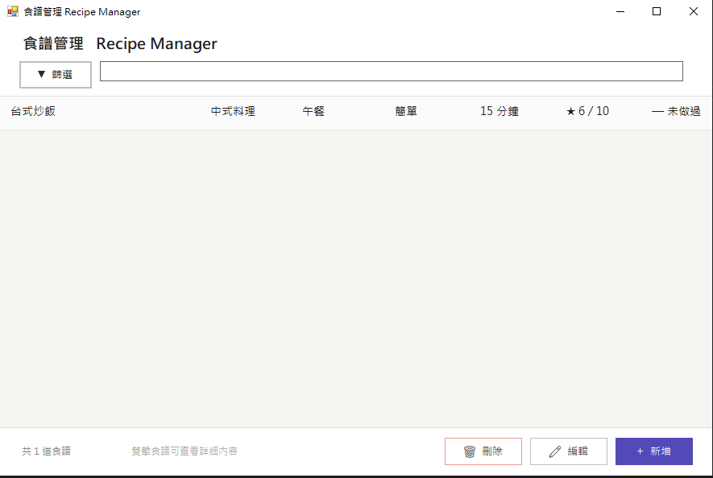

# 食譜管理程式 RecipeManager
## 專案簡介
本專案開發了一款具備直覺操作介面與流暢管理邏輯的食譜管理系統（Recipe Manager）。本系統採用 Windows Forms 技術開發，不僅支援食譜清單的一覽、即時搜尋與多條件複合篩選，還內建了「必填欄位防錯防護」與「雙擊檢視詳細佈局」，確保使用者在建立、編輯、查詢與維護個人食譜庫時，擁有高效、直覺且穩定的操作體驗 。

## 使用者畫面

## 執行說明書與結果判讀

### 操作流程說明
請依序執行以下步驟進行食譜管理與瀏覽操作：
1. **瀏覽與篩選食譜**：在主畫面中央的「食譜列表」瀏覽所有食譜紀錄，可在頂部搜尋欄輸入關鍵字進行即時過濾，或點擊「▼ 篩選」面板依據料理類型、難度等多種條件進行多維度篩選 。
2. **檢視詳細內容**：在列表上，滑鼠「點兩下（雙擊）」欲查看的食譜項目，系統會自動切換至「詳細食譜畫面」，呈現完整的食材清單與編號烹飪步驟。
3. **新增或修改食譜**：點擊主畫面右下角的「新增」按鈕可開啟表單建立新食譜；若要修改現有紀錄，可在選取食譜後點擊「編輯」進行資料更新。
4. **移除食譜記錄**：若有不再需要的食譜，可透過單擊選取或進入詳細畫面後點擊「刪除」按鈕，經系統對話框確認後即可移除。

### 功能按鈕與互動操作
* **搜尋欄即時過濾**：位於畫面頂部，輸入關鍵字即時連動列表 ，無需按 Enter 即可快速尋找目標食譜。
* **▼ 篩選按鈕**：控制進階篩選面板的展開與收合，支援料理類型、餐別、時間、難度、是否做過等跨類別同時過濾。
* **滑鼠雙擊 (Double Click)**：對準食譜列項目點兩下，做為快速開啟「食譜詳細分頁」的核心快捷操作。
* **新增 / 編輯 / 刪除組合鍵**：位於主畫面下方，提供集中且明確的食譜庫維護入口（編輯與刪除需先選取目標列）。

### 異常輸入與錯誤防治機制
為避免程式因操作矛盾、未填必要欄位或不合規格的資料導致系統崩潰，系統設有以下攔截警告：
1. **料理名稱必填防護**
  * 異常狀況：使用者在新增或編輯食譜時，將「料理名稱」欄位留空便直接點擊儲存。
  * 系統處理：系統會強制拦截儲存指令，並跳出警告訊息提示「料理名稱為必填項目」，拒絕寫入資料庫。
2. **純數字欄位格式驗證**
  * 異常狀況：在「烹飪時間」或「幾人份」等需要計數的欄位中，不小心輸入英文、文字或特殊符號。
  * 系統處理：系統限定僅能輸入純數字（例如：45 或 2），防止後端在進行數值轉換（Parse）時因格式不符導致程式當機。
3. **未選取項目操作防錯**
  * 異常狀況：在主畫面尚未單擊選取任何一列食譜時，直接點擊底部的「編輯」或「刪除」按鈕。
  * 系統處理：系統會進行 Index 合法性判定，若無選取目標則無法觸發後續表單彈出，有效防止因讀取 Null 物件導致系統損毀。
4. **刪除意圖安全確認**
  * 異常狀況：使用者在列表或詳細畫面點擊「刪除」按鈕時，可能屬於無意間的滑鼠誤觸 。
  * 系統處理：系統不會直接移除紀錄，而是強制彈出確認對話框，使用者必須明確選擇「是（Yes）」才會真正執行刪除；若選「否（No）」則安全取消操作。

### 結果判讀說明
食譜管理程式運作期間，介面將顯示以下即時資訊：
* **食譜詳細資訊（詳細畫面）**：上方以大字體突顯料理名稱與分類標籤 ，中央以卡片（卡片式佈局）清晰呈現烹飪時間、份量、難度與評分等核心摘要。
* **食材與步驟清單連動**：左側清楚條列所有食材與精確用量 ，下方則以獨立編號（1、2、3...）逐項導引烹飪流程。
* **動態統計列回報**：主畫面左下角會隨時回報當前列表中「共 X 道食譜」，讓使用者一目了然篩選後的統計數據。
* **評分與備註反饋**：點擊星星圖示可即時給予 2-10 分的評分（每點亮一顆代表 2 分），備註區則會直接呈現個人烹飪心得或注意事項。
